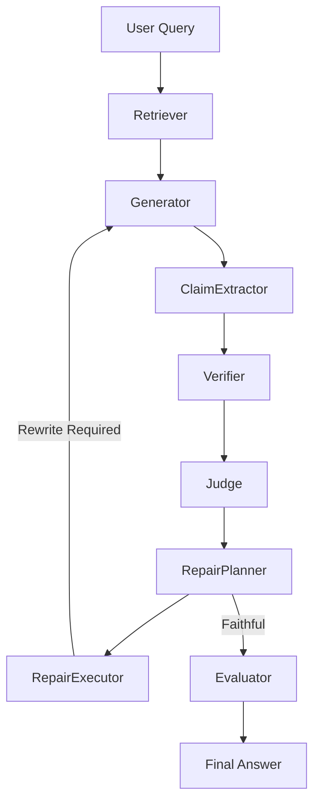

# ResearchGuard
**Self-Healing Hallucination Detection Framework**


---

## 🛑 The Problem: Hallucinations in RAG
Standard Retrieval-Augmented Generation (RAG) pipelines assume that if relevant context is injected into a prompt, the model will faithfully ground its answer. In reality, Large Language Models (LLMs) prioritize conversational fluidity over strict accuracy, frequently hallucinating by leaking parametric knowledge or making unverified inductive leaps.

**ResearchGuard** introduces a self-healing loop that forces the LLM to verify every atomic claim it makes against trusted retrieved evidence using Natural Language Inference (NLI).

---

## ✨ Features
- **FAISS Vector Store**: High-performance local similarity search.
- **BGE Embeddings**: State-of-the-art dense semantic retrieval (`BAAI/bge-large-en-v1.5`).
- **Groq Inference**: Lightning-fast, low-latency generation utilizing `llama3-70b-8192`.
- **DeBERTa NLI**: Robust cross-attention semantic verification (`cross-encoder/nli-deberta-v3-base`).
- **Deterministic Repair**: Autonomous diagnosis and self-healing of ungrounded generated claims.
- **Strict Extraction**: Constrains the LLM output space purely to evidence extraction, eliminating parametric leakage.
- **Safe Refusal Handling**: Actively protects and rewards the system for correctly refusing to answer unanswerable queries ("I don't know").

---

## 🏗️ Architecture



---

## 🧪 Experiments: 95% ↓ 10%
Through rigorous architectural ablation, ResearchGuard progressively crushed hallucination rates by shifting from standard QA prompting to a self-healing Strict Extraction engine.

- **V1 (Synthetic Corpus)**: 95.00% Hallucinations
- **V2 (Rich Corpus)**: 70.00% Hallucinations
- **V3 (Safe Refusals)**: 35.00% Hallucinations
- **V4 (Strict Extraction)**: **10.00% Hallucinations**

---

## 📊 Benchmarks (v1.0)
Based on an end-to-end evaluation using a complex 90-chunk representation of the LoRA paper:

| Metric | Score |
|--------|-------|
| **Faithfulness** | **0.97** |
| **Repair Rate** | 25.00% |
| **Avg Latency** | 8.59s |

---

## 🚀 Quickstart

1. **Clone the repository**
```bash
git clone https://github.com/Code-Krasher09/ResearchGuard.git
cd ResearchGuard
```

2. **Create a virtual environment**
```bash
python -m venv .venv
source .venv/bin/activate  # On Windows use: .venv\Scripts\activate
```

3. **Install dependencies**
```bash
pip install -r requirements.txt
```

4. **Initialize Setup**
```bash
python scripts/setup.py
```
*(Requires a `GROQ_API_KEY` set in your `.env` file)*

---

## 🎮 Demo

ResearchGuard comes with an interactive Gradio web application that allows you to easily test its hallucination-detection and synthesis capabilities.

1. **Start the Web UI**
```bash
python app.py
```

2. **Upload a Document**
- The repository does not bundle testing data to save space.
- Open the local web link (`http://127.0.0.1:7860`).
- Upload any scientific PDF (e.g., the *Attention Is All You Need* paper or the *LoRA* paper).
- ResearchGuard will automatically parse, chunk, and embed the document.

3. **Ask Questions**
- Type a query and watch the self-healing loop extract claims, verify them with NLI, repair hallucinations, and synthesize a perfectly grounded final answer!

*(Note: You can still run the programmatic end-to-end evaluation trace via `python scripts/test_e2e.py` if desired).*

---

## 🗺️ Roadmap

- **v1.0 (Current)**: Architecture frozen. Self-healing loop verified.
- **v1.1**: Reranker integration (CrossEncoder) for high-scale multi-document retrieval.
- **v2.0**: Agentic Retrieval (iterative dynamic query formulation). Native citation UI linking.

---

## 📚 Citation
If you use ResearchGuard in your work, please cite:
```bibtex
@misc{researchguard2026,
  author = {Antigravity},
  title = {ResearchGuard: Self-Healing Hallucination Detection Framework},
  year = {2026},
  publisher = {GitHub},
  journal = {GitHub repository},
  howpublished = {\url{https://github.com/Code-Krasher09/ResearchGuard}}
}
```

---

## 📄 License
MIT License
