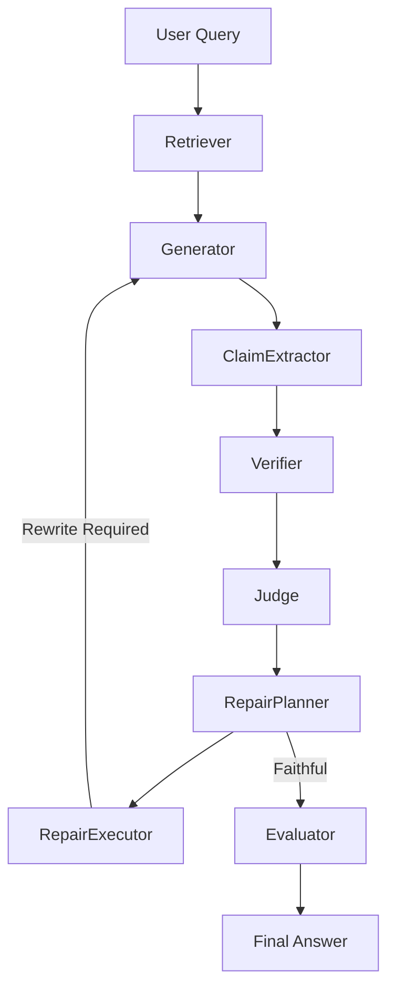

# Architecture

## 1. Architecture Overview
ResearchGuard is a self-healing grounded QA system. It ensures that language models adhere strictly to factual evidence retrieved from trusted corpora. If a generated answer contains unsupported claims, the system autonomously repairs it in a deterministic loop until the output is completely faithful to the source material.

ResearchGuard has reached a production-ready **v1.0** with the following baseline metrics:
- **Hallucination Rate**: 10.00%
- **Avg Faithfulness**: 0.97
- **Repair Rate**: 25.00%
- **Avg Latency**: 8.59s
- **Recall@5**: 1.00

---

## 2. High Level Pipeline

---

## 3. Component Inventory

### Retriever
- **Purpose**: Embeds the query and fetches the top `k` most semantically relevant chunks from the trusted corpus.
- **Input**: User query (`str`)
- **Output**: `List[RetrievedChunk]`
- **Dependencies**: BGE models (`sentence-transformers`)

### Generator
- **Purpose**: Extracts explicit factual evidence from the retrieved chunks based on the query, utilizing strict constraints.
- **Input**: User query (`str`), Retrieved context (`List[RetrievedChunk]`), `mode` (`str`)
- **Output**: `GeneratedAnswer`
- **Dependencies**: Groq API (e.g., LLaMA-3)

### ClaimExtractor
- **Purpose**: Segments the generated answer into atomic, verifiable sentences. Handles safe refusals ("I don't know") by bypassing verification.
- **Input**: Generated answer (`str`)
- **Output**: `List[Claim]`
- **Dependencies**: SpaCy (`en_core_web_sm`)

### Verifier
- **Purpose**: Cross-references each atomic factual claim against the original retrieved chunks using DeBERTa NLI to classify them as `SUPPORTED`, `NEUTRAL`, or `CONTRADICTED`.
- **Input**: `List[Claim]`, `List[RetrievedChunk]`
- **Output**: `List[VerificationResult]`
- **Dependencies**: DeBERTa-v3 NLI (`transformers`)

### Judge
- **Purpose**: Computes the aggregate faithfulness score. Automatically flags the answer for repair if contradictions exist or if the overall score falls below the threshold. Ignores `REFUSAL` claims.
- **Input**: `List[Claim]`, `List[VerificationResult]`
- **Output**: `Judgment`
- **Dependencies**: Native Python logic

### RepairPlanner
- **Purpose**: Diagnoses the nature of the failure (e.g., contradictions vs low support) and selects the appropriate deterministic repair strategy (e.g., rewrite answer, increase retrieval `k`).
- **Input**: `Judgment`, Iteration count (`int`)
- **Output**: `RepairPlan`
- **Dependencies**: Native Python logic

### RepairExecutor
- **Purpose**: Orchestrates the loop back to earlier modules based on the Planner's strategy.
- **Input**: `RepairPlan`, `PipelineComponents`
- **Output**: `PipelineResult`
- **Dependencies**: All pipeline modules

### Evaluator
- **Purpose**: An offline monitoring module that tracks hallucination rates, repair rates, latencies, and calculates empirical reliability metrics.
- **Input**: `PipelineResult`, Ground truth (optional)
- **Output**: `EvaluationResult`
- **Dependencies**: RAGAS / Scikit-learn (Cosine Similarity)

---

## 4. Design Principles

- **Separation of concerns**: Prompt strings stay in `PromptManager`, logic stays in module implementations, and coordination stays in the `RepairExecutor`.
- **Deterministic repair**: The repair loop uses rigid rule-based enums rather than relying on another LLM to prompt itself out of a hallucination.
- **Strict extraction**: Generating helpful text introduces parametric leakage. We restrict the generator strictly to extraction.
- **Safe refusals**: Answering "I don't know" is a faithful response to an unanswerable question, and is actively encouraged and shielded from contradiction penalties.
- **Faithfulness over helpfulness**: We enforce a hard ceiling on hallucinations by willingly sacrificing conversational fluidity.

---

## 5. Frozen Decisions

Key architectural decisions have been finalized and frozen. Refer to `decision_log.md` for context and rationales.

- **Decision-013**: Planner strictly diagnoses; it does not write prompts.
- **Decision-014**: Repair flows use strict `Enum` strategies.
- **Decision-015**: Hard cap of `MAX_REPAIR_ATTEMPTS = 3` to bounded execution.
- **Decision-017**: Executor solely coordinates; PromptManager owns all prompt text.
- **Decision-018 & 019**: Dual evaluation system (RAGAS + Semantic Fallback).
- **Decision-022**: Single unified entrypoint via `ResearchGuard().run()`.
- **Decision-036**: Safe Refusals (e.g., "I don't know") are faithful behaviors and bypass verification penalties.
- **Decision-037**: Strict Extraction Architecture.

---

## 6. Supported Modes

The Generator natively supports multiple configuration policies:
- `strict_extraction` (Default): The LLM is heavily constrained to extract explicit facts. Minimizes parametric leakage at the expense of conversational fluidity.
- `qa`: Standard scientific question-answering assistant.

---

## 7. Known Limitations

- **Single paper corpus**: The system was tested explicitly on a single comprehensive document (the LoRA paper). Multi-document retrieval scale is untested.
- **No citations**: The Generator quotes text but does not natively link inline citation tags (`[1]`) back to specific chunks in the UI.
- **No reranker**: The Retriever relies purely on vector embeddings. There is no CrossEncoder to rerank top chunks, which might become necessary for >1000 document corpora.
- **CPU bottlenecks**: The DeBERTa NLI and BGE Embedding models run natively on CPU, meaning the verification pass is heavily bottlenecked by local compute speed.
