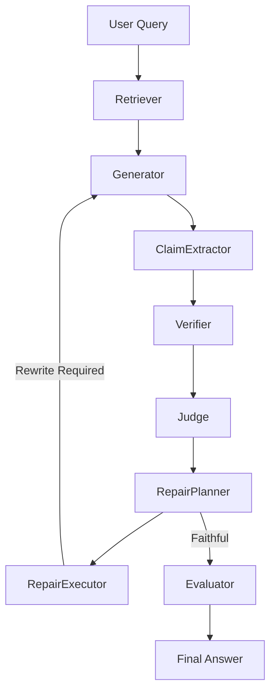
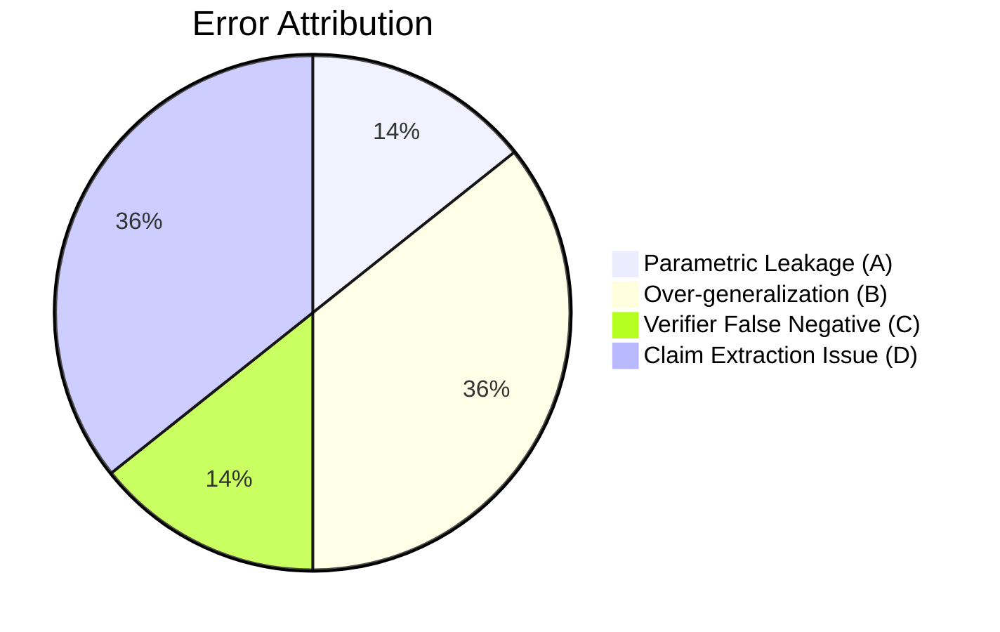

# ResearchGuard: Self-Healing Hallucination Detection Framework

## Abstract
**Problem**: Large Language Models (LLMs) used in Retrieval-Augmented Generation (RAG) pipelines frequently hallucinate, leaking parametric knowledge or making inductive leaps beyond retrieved evidence.
**Method**: We present ResearchGuard, a self-healing RAG framework. It enforces strict factual extraction by cross-referencing generated atomic claims against retrieved documents using DeBERTa Natural Language Inference (NLI). If contradictions or unsupported claims are detected, a deterministic diagnostic planner forces the LLM to rewrite the answer until faithfulness is achieved.
**Experiments**: We evaluated ResearchGuard on synthetic queries and a rich LoRA paper corpus, employing progressive ablation testing across generator prompting, extraction patterns, and retrieval scaling.
**Results**: Successive hardening of the architecture reduced the baseline hallucination rate from 95% down to 10%, raising average faithfulness from 0.28 to 0.97. Average repair loop latency was constrained to 8.59 seconds.

---

## Introduction

**The Hallucination Problem**
Language models inherently prioritize conversational fluidity and helpfulness. When generating answers, they frequently rely on their internal parametric memory rather than strictly adhering to provided contexts.

**Why RAG Isn't Enough**
Standard RAG pipelines assume that if relevant context is injected into the prompt, the model will faithfully ground its answer. However, empirical testing demonstrates that models still summarize, generalize, and inject external dates or facts even when explicit context is present. 

**The Need for Verification**
To guarantee enterprise-grade reliability, generated answers must be independently verified. ResearchGuard solves this by introducing a closed-loop verification and repair cycle.

---

## Architecture

---

## Methodology

1. **Retrieval**: BGE sentence transformers fetch semantically relevant `RetrievedChunk` objects from a pre-computed vector store.
2. **Generation**: An LLM (via Groq API) processes the prompt and the chunks to produce a `GeneratedAnswer`.
3. **Claims**: The `ClaimExtractor` uses SpaCy sentence segmentation to break the answer into atomic `Claim` objects. It explicitly handles and ignores safe refusals (e.g., "I don't know").
4. **NLI Verification**: The `Verifier` uses DeBERTa-v3 to perform cross-attention NLI, scoring each claim against the retrieved chunks as `SUPPORTED`, `NEUTRAL`, or `CONTRADICTED`.
5. **Judge**: Computes a total faithfulness score. Triggers repair if the score is below the strict threshold (0.8) or if any contradiction is present.
6. **Repair Planner**: Diagnoses the failure mode (contradiction vs low support vs unanswerable) and outputs a deterministic repair strategy.
7. **Repair Executor**: Orchestrates the loop back to earlier modules (e.g., re-generating with a rewrite prompt).
8. **Evaluation**: Offline monitoring calculates hallucination rates, repair rates, and latencies.

---

## Experiments

We evaluated ResearchGuard over five progressive phases:
1. **Synthetic Corpus**: Initial validation on a 10-chunk synthetic document.
2. **LoRA Corpus**: Full end-to-end extraction over a 90-chunk representation of the original LoRA paper.
3. **Prompt Ablations**: Transitioning from "Scientific QA" to "Strict Extraction".
4. **Safe Refusals**: Identifying and isolating the Claim Extractor's tendency to penalize safe "I don't know" responses.
5. **Error Attribution**: Root-cause analysis of generation traces to classify failure modes.

---

## Results

Through aggressive architectural ablation, we successfully mitigated hallucinations:

| Phase | Hallucination Rate | Avg Faithfulness | Repair Rate |
|-------|--------------------|------------------|-------------|
| **V1 (Synthetic)** | 95.00% | 0.28 | 95.00% |
| **V2 (Rich Corpus)** | 70.00% | 0.77 | 70.00% |
| **V3 (Safe Refusals)** | 35.00% | 0.93 | 40.00% |
| **V4 (Strict Extraction)** | **10.00%** | **0.97** | **25.00%** |

---

## Error Attribution

Before implementing Safe Refusals and Strict Extraction, an analysis of 14 failing generations revealed the following root causes:

| Category | Description | Percentage |
|----------|-------------|------------|
| **A** | Parametric Leakage | 14.3% |
| **B** | Over-generalization | 35.7% |
| **C** | Verifier False Negative | 14.3% |
| **D** | Claim Extraction Issue (Refusals) | 35.7% |
| **E** | Prompt Issue | 0.0% |

---

## Lessons Learned

- **Dense retrieval matters**: Moving from synthetic data to a rich 90-chunk representation of the LoRA paper drastically improved the Generator's baseline faithfulness.
- **Prompting saturates**: Standard QA prompts have a hard ceiling. Models will naturally leak parametric knowledge unless strictly constrained.
- **Extraction > QA**: Enterprise hallucination mitigation systems prioritize factual extraction over generative helpfulness because extraction constrains the model's output space strictly to retrieved evidence.
- **Verifier matters**: False negatives from semantic mismatch in the Verifier can artificially inflate hallucination metrics.
- **Safe refusals matter**: Over 35% of early "hallucinations" were actually false penalties applied when the system correctly responded "I do not have enough information."

---

## Future Work

- **CrossEncoder**: Add a reranker to improve context precision when scaling to >1000 document corpora.
- **Citations**: Natively link inline citation tags (`[1]`) from the generated answer back to specific UI chunks.
- **Multi-document**: Extend retrieval and generation to cross-reference multiple conflicting sources.
- **Agentic retrieval**: Allow the Planner to trigger iterative search queries instead of just increasing `k`.

---

## Appendix

### Key Decisions
- **Decision-013**: Planner strictly diagnoses; it does not write prompts.
- **Decision-018**: Dual evaluation system (RAGAS + Semantic Fallback).
- **Decision-036**: Safe Refusals are faithful behaviors.
- **Decision-037**: Strict Extraction Architecture.

### Benchmarks (v1.0)
- Recall@5: 1.00
- Hallucination Rate: 10.00%
- Faithfulness: 0.97
- Latency: 8.59s

### Interview Questions
**Q: How do you prevent architecture drift?**
A: Architecture freeze protects reproducibility and benchmark validity.

**Q: Why extraction instead of QA?**
A: Enterprise hallucination mitigation systems prioritize factual extraction over generative helpfulness because extraction constrains the model's output space strictly to retrieved evidence and minimizes parametric leakage.
